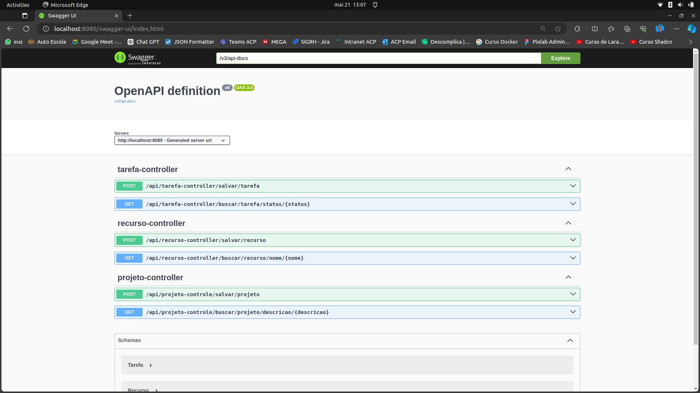

# Aplicação Spring Boot - Atividade Projeto, Recurso e Tarefa


## Pré-requisitos

    - Java JDK 17
    - Docker
    - Docker Compose

## Ferramentas de Desenvolvimento

Este projeto foi desenvolvido utilizando as seguintes ferramentas:

 - **Visual Studio Code:** Um editor de código fonte altamente configurável, construído para desenvolvimento eficiente.

 - **Spring Boot Extension Pack:** Uma extensão para o VSCode que oferece suporte ao desenvolvimento de aplicativos Spring Boot, fornecendo funcionalidades como realce de sintaxe, completude de código e depuração.

 - **Extension Pack for Java:** Um conjunto de extensões para o VSCode que oferece suporte ao desenvolvimento em Java, incluindo funcionalidades como realce de sintaxe, completude de código, depuração e gerenciamento de dependências.

 - **Database Client JDBC by Weijan Chen:** Uma extensão útil para gerenciar bancos de dados diretamente no VSCode, permitindo que você visualize esquemas de banco de dados, execute consultas SQL e gerencie seus dados sem sair do editor.
   
 - **REST Client:** Uma extensão que permite testar chamadas de API diretamente do VSCode, com suporte a sintaxe de cURL, além de oferecer recursos como histórico de solicitações e visualização de respostas.

## Configuração Inicial

Clone e entre no diretório do projeto:

```sh
git clone git@github.com:everton-nfs/api.git
cd api
```
## Execução com Docker Compose

1. Construir e rodar a aplicação:

```sh
docker-compose up --build
```

2. Parar a aplicação:

```sh
docker-compose down
```
## Conectar ao banco utilizando a extensão Database Client JDBC

Para conectar-se ao banco de dados MySQL configurado, use a extensão Database Client JDBC no Visual Studio Code seguindo estes passos:

1. Abra o Visual Studio Code e acesse a extensão Database Client JDBC.
2. Clique em "Create New Connection" ou "Nova Conexão".
3. Selecione MySQL como tipo de banco de dados.
4. Preencha os detalhes da conexão:
   - **Host:** 127.0.0.1
   - **Port:** 3306
   - **Username:** root
   - **Password:** 12345678
   - **Database:** api_spring
5. Após a conexão ser estabelecida com sucesso, você verá uma mensagem indicando que a conexão foi bem-sucedida conforme a imagem abaixo.


## Executando o Projeto com o Spring Boot Dashboard

Você pode executar o projeto Spring Boot diretamente do Spring Boot Dashboard no Visual Studio Code. Siga estas etapas:

1. Abra o Visual Studio Code.
2. No Spring Boot Dashboard, clique em Run ao lado do nome do projeto.
3. A aplicação será iniciada automaticamente conforme a imagem abaixo.


A aplicação estará disponível em **http://localhost:8080.**

## Documentação da API com Swagger

A documentação da API está disponível através do Swagger UI. Para acessá-la, navegue até:

**http://localhost:8080/swagger-ui/index.html**

Através do Swagger UI, você pode visualizar todos os endpoints disponíveis da atividade, seus parâmetros, e realizar chamadas de teste diretamente pela interface, conforme a imagem abaixo.



<!-- ## Projeto Completo

Para acessar o projeto completo siga os comandos abaixo do clone especifico:

```sh
git clone -b dev git@github.com:everton-nfs/api.git
cd api
``` -->

